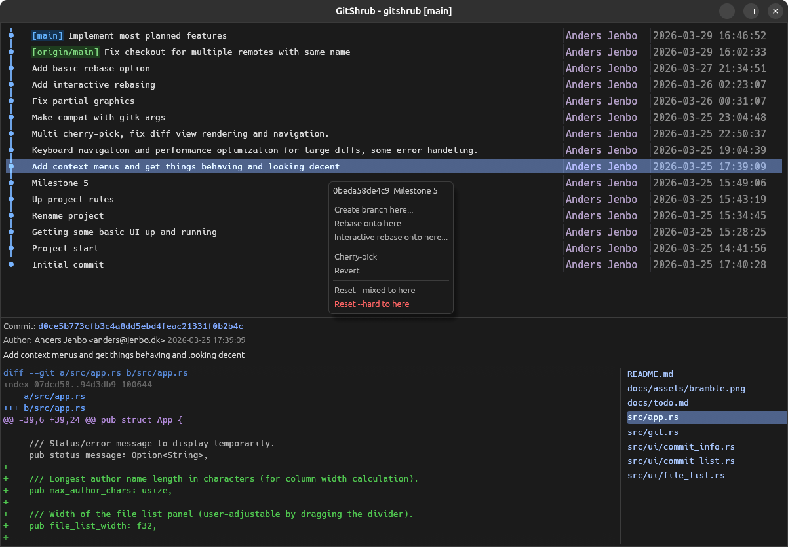

# GitShrub 🥦

<p align="center">
  
</p>

The "don't touch my garbage" git client.

<p align="center">
  
</p>

A git history viewer that doesn't look broken. It won't win any design awards, but copy-paste works and the UI doesn't look like Windows Vista lost its theme folder. It has a possum as its mascot because it caters to a certain work style. It will bite you if you do things wrong, but you won't if you're me.

## What makes it different

- **No confirmation dialogs.** Actions execute immediately. You're an adult.
- **Reflog in the graph.** `--reflog` shows orphaned commits (pre-amend, pre-reset, pre-rebase) right in the tree. The safety net for the no-confirmation policy. Your old commits are still in the garbage pile, you just need to find them.
- **Multi cherry-pick with reorder.** Select multiple commits, drag them into the order you want, pick or skip each one.
- **Big abort button.** When you're in the middle of a rebase gone wrong and can't remember the right `--abort` flag, there's a banner at the top with a button. It also shows continue when applicable.
- **Right-click origin/master.** You don't need a local tracking branch to checkout. If you can see it in the graph, you can act on it.
- **Interactive rebase from the graph.** Right-click any commit, reorder with drag-and-drop, set actions per commit (pick, reword, edit, squash, fixup, drop).

## Features

- Commit graph with color-coded branch/merge lines
- Branch labels `[master]` and tag labels `<v1.0>` rendered inline
- Unified diff viewer with file list sidebar
- Multi-select with Shift+Click and Ctrl+Click
- Keyboard navigation (Up/Down/Home/End/PgUp/PgDn)
- Detects in-progress rebase, cherry-pick, merge, bisect, and revert

## Usage

```sh
gitshrub                          # current branch
gitshrub --all                    # all branches
gitshrub --reflog                 # show orphaned commits
gitshrub feature/login            # specific branch or tag
gitshrub -- path/to/file.rs      # file or directory history
gitshrub --all main -- src/       # combine them
```

Run from inside a git repository.

## Building

```sh
cargo build --release
```

The binary will be at `target/release/gitshrub`. Only runtime dependency is `git` on your PATH.

## License

MIT